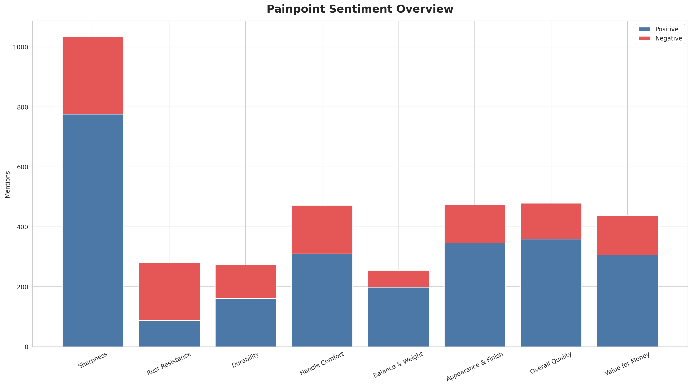
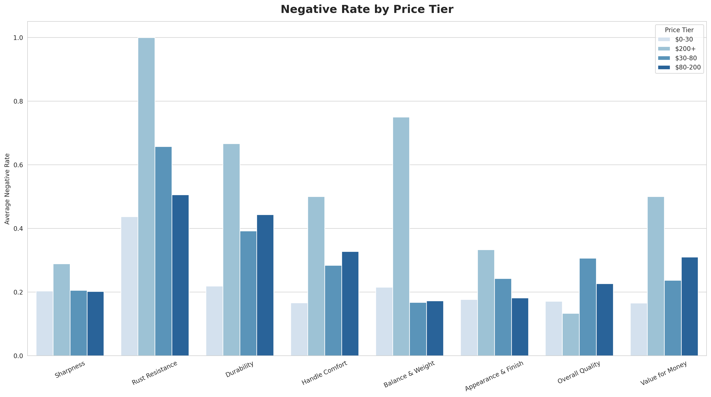
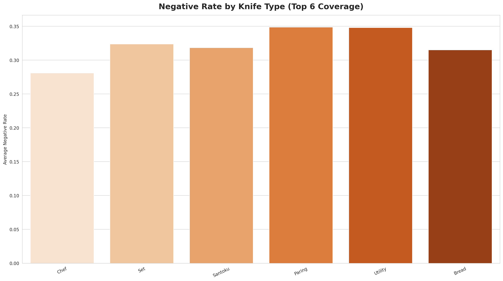
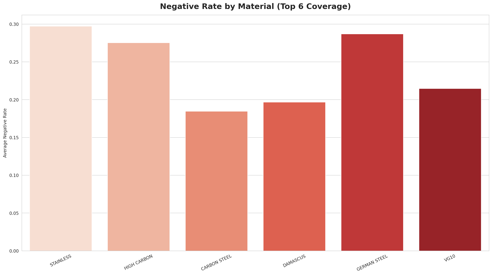
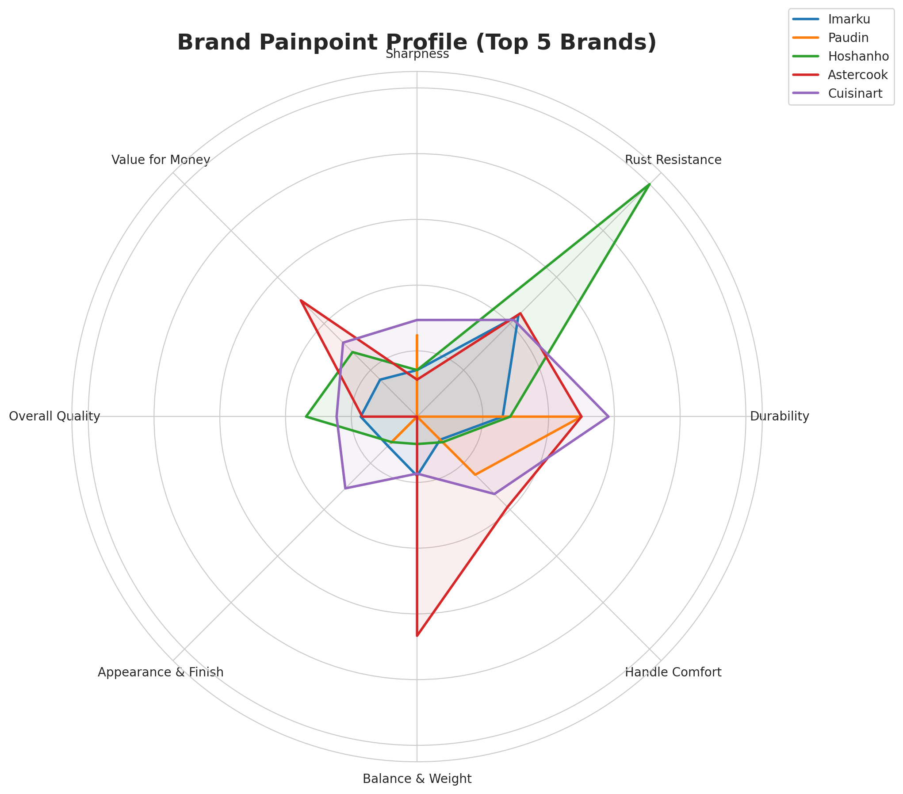
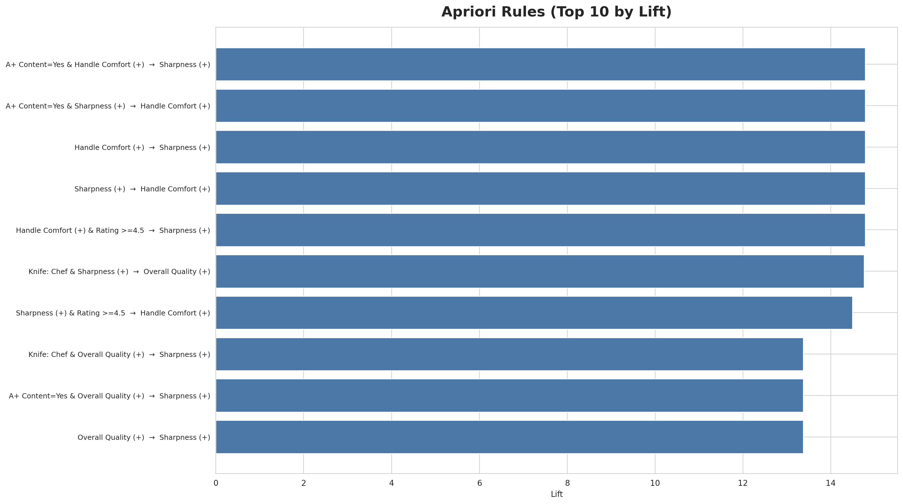

# 三创赛任务总结：知识图谱 + 关联分析（Amazon US 厨刀品类）
**日期**：2026-02-05  
**范围**：数据准备、图谱导出（Neo4j）、关联规则（Apriori）、比赛展示可视化（6张）

---

## 1. 本阶段目标（做了什么）
本阶段围绕“厨刀品类数据洞察与品牌出海”方案中的 **第六层：知识图谱与关联分析层**，完成了可复现的数据准备与展示闭环：
- 将原始清洗后的结构化数据整理为 **Neo4j 可导入的节点/边 CSV**
- 将商品属性离散化为 **Apriori 可用的 transaction items**，并产出可解释的关联规则
- 生成 6 张比赛展示图（16:9，英文标签，PNG+SVG），可直接插入 PPT/海报

---

## 2. 输入数据源（从哪里来）
核心输入（来自现有项目数据文件）：
- `预测建模/data/products_clean.csv`：商品结构化信息（asin、brand、price、bsr、文本字段等）
- `预测建模/data/reviews_cleaned.csv`：评论清洗信息（review_id、asin、rating、date、text 等）
- `预测建模/data/absa_detailed.csv`：方面级情感（review_id、aspect、sentiment、score）

可选输入（如存在则增强“关键词-竞品网络”）：
- `amazon_spasers_v2.0/data/amazon_data.db` 的 `search_results` 表

---

## 3. 口径与方法（怎么做的）
### 3.1 痛点体系 A（固定 8 类）
- sharpness / rust_resistance / durability / handle_comfort  
- balance_weight / appearance_finish / overall_quality / value_for_money

映射文件：
- `知识图谱分析与关联层/dict/painpoint_map.csv`

### 3.2 材质与刀型抽取（规则词典 + 文本匹配）
抽取来源按优先级：`title` > `bullet_points_text` > `description_clean`  
词典文件：
- `知识图谱分析与关联层/dict/material_lexicon.csv`
- `知识图谱分析与关联层/dict/knife_type_lexicon.csv`

### 3.3 产品-痛点聚合（用于图谱边属性 & Apriori 标签）
将 ABSA 通过 `review_id -> asin` 关联后聚合，得到：
- `mention_n / pos_n / neg_n / avg_score / neg_ratio / pos_ratio`

聚合产物：
- `知识图谱分析与关联层/reports/product_painpoint_agg.csv`

### 3.4 Apriori 交易表（商品粒度）
每个 `asin` 一条 transaction，items 由下列离散项组成：
- `price_tier=0/1/2/3`（$0-30 / $30-80 / $80-200 / $200+）
- rating bucket（`rating>=4.5` / `rating=4.0-4.5` / `rating<4.0`）
- sales bucket（`sales<100` / `sales=100-999` / `sales>=1000`，若缺失则不打）
- `is_fba=1`、`has_aplus=1`
- `material=...`、`knife_type=...`
- `painpoint=xxx_positive/negative`（基于聚合阈值：mention_n>=5 且 neg_ratio>=0.30 或 pos_ratio>=0.60）

交易表：
- `知识图谱分析与关联层/assoc_export/transactions_product.csv`

### 3.5 Neo4j 图谱 Schema（最小可用）
节点：
- Brand / Product / Material / KnifeType / PainPoint （可选 Keyword）

边：
- Brand-[:SELLS]->Product
- Product-[:HAS_MATERIAL]->Material
- Product-[:HAS_KNIFE_TYPE]->KnifeType
- Product-[:HAS_PAINPOINT]->PainPoint（带 neg_ratio 等属性）
- （可选）Keyword-[:RANKS]->Product

导入示例：
- `知识图谱分析与关联层/neo4j_load_example.cypher`

---

## 4. 产物清单（交付物）
### 4.1 脚本
- `知识图谱分析与关联层/prepare_kg_assoc.py`：生成 kg_export + assoc_export + reports
- `知识图谱分析与关联层/run_apriori_rules.py`：从交易表生成关联规则（不依赖 mlxtend）
- `知识图谱分析与关联层/generate_viz.py`：生成 6 张比赛展示图（PNG+SVG）

### 4.2 Neo4j 导入 CSV（`知识图谱分析与关联层/kg_export/`）
- `node_brand.csv`（256 brands）
- `node_product.csv`（946 products）
- `node_material.csv`（12 materials）
- `node_knife_type.csv`（13 knife types）
- `node_painpoint.csv`（8 painpoints）
- `node_keyword.csv`（可选，当前为 6 keywords）
- `edge_brand_sells_product.csv`
- `edge_product_has_material.csv`
- `edge_product_has_knife_type.csv`
- `edge_product_has_painpoint.csv`
- `edge_keyword_ranks_product.csv`（可选）
- `edge_brand_competes_brand.csv`（竞品边：启发式）

### 4.3 关联分析（`知识图谱分析与关联层/assoc_export/`）
- `transactions_product.csv`（946 transactions）
- `apriori_rules.csv`（50 rules）

### 4.4 报告（`知识图谱分析与关联层/reports/`）
- `data_quality_summary.json`
- `product_painpoint_agg.csv`
- `apriori_rules.md`

### 4.5 可视化（`知识图谱分析与关联层/visuals/`）
共 6 张图（PNG+SVG）：
1. `painpoint_sentiment_overview`
2. `painpoint_negative_rate_by_price_tier`
3. `painpoint_negative_rate_by_knife_type`
4. `painpoint_negative_rate_by_material`
5. `brand_painpoint_profile_top5`
6. `apriori_painpoint_rules_top`

---

## 5. 复现步骤（建议比赛前统一跑一遍刷新数据）
> 注意：本机 PowerShell profile 被禁用，统一用 `-NoProfile`。

1) 生成图谱/交易表/报告：
```powershell
powershell -NoProfile -Command "python .\知识图谱分析与关联层\prepare_kg_assoc.py"
```

2) 生成 Apriori 规则：
```powershell
powershell -NoProfile -Command "python .\知识图谱分析与关联层\run_apriori_rules.py"
```

3) 生成比赛展示图：
```powershell
powershell -NoProfile -Command "python .\知识图谱分析与关联层\generate_viz.py"
```

---

## 6. 数据质量与合理性检查（结论）
### 6.1 一致性
- 商品：946 ASIN（唯一）
- 评论：2218 review（review_id 唯一）
- ABSA：3778 条
- 外键缺失：0（reviews→products、absa→reviews 均对齐）

### 6.2 覆盖率（重要：比赛展示需标注）
- 痛点边覆盖：116 / 946 = **12.3%**
- 材质边覆盖：896 / 946 = 94.7%
- 刀型边覆盖：942 / 946 = 99.6%
- 关键词边覆盖：717 / 946 = 75.8%（取决于 search_results 是否存在）

> 解释口径建议：痛点分析基于“评论足够/可做ABSA的商品子集”，非全量 946 商品。

### 6.3 Apriori 合理性
- Transactions：946
- Unique items：53（项空间可控，适合展示）
- Frequent itemsets：2183（min_support=0.02）
- Rules：50（min_confidence=0.3）
- 规则含义：是“属性共现/痛点共现”的统计关联，不代表因果关系或真实同购。

---

## 7. 比赛展示图（可直接插 PPT）
### 7.1 Painpoint Sentiment Overview

讲述要点：用户最关注的痛点维度是什么；正负反馈结构是否偏负面；用于引出“需求机会点”。

### 7.2 Negative Rate by Price Tier

讲述要点：不同价格带的痛点敏感度不同；可据此提出“分价格带的产品优化策略”。

### 7.3 Negative Rate by Knife Type (Top 6 Coverage)

讲述要点：不同刀型的主要负面来源不同；用于“品类/子品类选型与产品线规划”。

### 7.4 Negative Rate by Material (Top 6 Coverage)

讲述要点：材质与痛点存在明显关联；用于“材质选型 + 卖点表达（防锈/锋利/耐用）”。

### 7.5 Brand Painpoint Profile (Top 5 Brands)

讲述要点：竞品对比视角；能说明“我方品牌在何处可差异化”。

### 7.6 Apriori Rules (Top 10 by Lift)

讲述要点：用规则把“属性组合 → 痛点/满意度”连接起来，提供可解释证据支撑策略。

---

## 8. 局限与风险（答辩需提前准备回应）
1) **痛点覆盖率偏低（12.3%）**：原因通常是 ABSA/情感标签只对“评论足够”的商品可用；展示时必须标注样本边界。  
2) 材质/刀型为规则抽取：存在误匹配/漏匹配，词典需持续迭代。  
3) Apriori 是“共现关联”不是“因果”：需要与业务常识/案例结合解释。  
4) 竞品边为启发式：用于可视化/展示可行，严谨竞品定义需引入更多市场变量（关键词曝光、类目位次、价格带等）。

---

## 9. 下一步（提升比赛说服力的优先级路线）
- 提高痛点覆盖率：补抓评论、或把阈值从 mention_n>=5 调整到 >=3，并做置信度/误差条
- 词典升级：加入更多钢材/工艺/手柄材质词条；增加同义词与否定规则
- 图谱查询 Demo：准备 3 个 Neo4j 查询（某材质→高负面痛点；品牌→差异化点；关键词→竞品网络）
- 增加一页 Dashboard：把 6 张图整合成 1 页总览（适合路演大屏）

